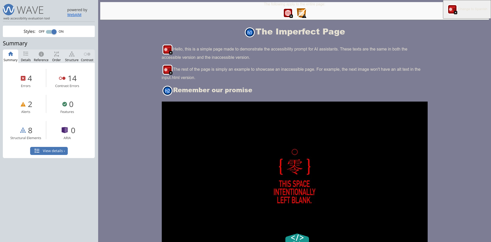

# The Perfect Prompt

**¡El README.md también está en Español!** ([Enlace a la versión en español](#readme-en-español))

The following prompt is designed to make static HTML pages
accessible by using semantic HTML5 tags, adding ARIA attributes
and more.

```
Could you rewrite the attached file but in an accessible way so that it follows the WCAG 2.2?
The file should follow the following guidelines:
- It should have ARIA attributes in forms, buttons, links, images, etc.
- It should use semantic HTML5 tags like <header>, <main>, <aside> or <footer>
- It should add descriptive texts for the images. The context for that image should be found from tne surrounding text, file name and the "strings.en.json" file attached. This description should be brief
- It should use header tags correctly, meaning that the <h1> is used for a main title and other headers are used for subsections
- It should have accessible forms that can be navigated with the keyboard and includes the correct tags and attributes that could make the page usable for anyone
- It should have great color contrasts. The page should follow AAA standards so it is imperative that ALL elements have great contrast. Add as much CSS as needed to ensure that the contrast is as good as possible.
- While it's important to have great color contrasts, using fully white or fully black colors is prohibited
- The navigation with a keyboard should be fluid and accessible
- Table <td> and <th> tags without text are an accessibility problem, they should have some text
- If any curse word, profanity or offensive language is found, change it for another, more family-friendly, word
- The overall layout and style (other than the colors) must remain the same as in the original file. Changes that are not done purely for accessibility purposes is completely disallowed.
```

The prompt has been tested in GitHub Copilot.

AI assistants that are not integrated in your IDE like ChatGPT
require that you use a slightly different version of the prompt
where you can also add your HTML code.

This prompt looks like this:

```
Could you rewrite the attached file but in an accessible way so that it follows the WCAG 2.2?
The file should follow the following guidelines:
- It should have ARIA attributes in forms, buttons, links, images, etc.
- It should use semantic HTML5 tags like <header>, <main>, <aside> or <footer>
- It should add descriptive texts for the images. The context for that image should be found from tne surrounding text, file name and the "strings.en.json" file attached. This description should be brief
- It should use header tags correctly, meaning that the <h1> is used for a main title and other headers are used for subsections
- It should have accessible forms that can be navigated with the keyboard and includes the correct tags and attributes that could make the page usable for anyone
- It should have great color contrasts. The page should follow AAA standards so it is imperative that ALL elements have great contrast. Add as much CSS as needed to ensure that the contrast is as good as possible. Input elements and buttons especially can be the source accessibility problems, so pay extra attention to those.
- While it's important to have great color contrasts, using fully white or fully black colors is prohibited
- The navigation with a keyboard should be fluid and accessible
- Table <td> and <th> tags without text are an accessibility problem, they should have some text
- If any curse word, profanity or offensive language is found, change it for another, more family-friendly, word
- The overall layout and style (other than the colors) must remain the same as in the original file. Changes that are not done purely for accessibility purposes is completely disallowed.
- Every ID of every element must stay the same

The contents of the files are:
```
The contents of the files are then specified in the following format for every file that you want ChatGPT to see:
```
INPUT.HTML
<contents of file>


STRINGS.EN.JSON
<contents of file>
```

The slight modifications to the prompt are there to tell ChatGPT to maintain IDs of elements and keep good contrasts especially in buttons and input elements. This is because ChatGPT tends to mess those up, while GitHub Copilot does get it right.

Checks were primarily made with WAVE and Lighthouse.

## Practical Example

### Input file

You can check out [the input.html file](input.html) to see the original page. This page has several accessibility problems as shown in the following image:



### GitHub Copilot

The following page was generated by GitHub Copilot. The AI's chat feature was ran from Visual Studio Code and was given the prompt along with extra context (the `strings.en.json` file where the actual text contents of the page are). You can [see this file yourself here](output.html).


It's worth noting that the bar at the top of the page was added by WAVE and not an issue with the prompt.

As we can see, GitHub Copilot was able to improve the contrast of every element, including the top-right button, as well as add aria labels and other accesibility features to the page.

### ChatGPT

ChatGPT, not being an assistant dedicated exclusively to help with code, had its own set of quirks that I had to manually patch in the prompt. You can see the modified prompt above, but in short, it required two modifications:
- Asking it to pay extra attention to input elements and buttons when checking for contrast
    - Without this, ChatGPT left them untouched, which made buttons unreadable.
- Asking it to never modify or remove IDs of existing elements.
    - This is technically redundant, as we already asked the AI to not make any change unrelated to accesibility but, without it, ChatGPT would remove some element's IDs, potentially breaking JavaScript Scripts.

In [this file](output.gpt.html) and in the following screenshot, we can see ChatGPT's output. As we can see, this assistant generated a "white mode" webpage instead of a "dark mode" one, which would seem more logical given the input file. Regardless, the accessilibility is also good:


You can also force ChatGPT to respond in the chat instead of in an interactive code editor. Surprisingly, this yields a different version of the page. [You can check it out by yourself here](output,gpt-v2.html).


Sadly, this extra (and semi-hidden) version of ChatGPT changed the overall style of the page, creating contrast errors in the process.

It also did some modifications that we didn't ask for, such as **adding extra elements** like the copyright notice in the footer and a `<header>` element wrapping the language selection button. It did use semantic HTML5 tags but we explicitly told it not to do any modification that didn't improve accessibility.

**From this test, we can conclude that ChatGPT's default behavior of outputting the code into an in-site code editor gives better code.**

## Common problems found

Both GitHub Copilot and ChatGPT tend to give webpages with semantic HTML5 tags but poor or simply insufficient contrast.

Some elements like `<button>` and `<input>` were often left unmodified by the assistants, resulting in very poor contrast, rendering some parts of the page completely unreadable. This is because we only set the `<body>`'s background to a darker color and the text color to almost white.

Special attention had to be put into making the AIs handle those aspects of the CSS properly.

To solve those issues I tweaked the prompt. A complete guide on how to do that can be found here:
- [The Complete Guide to Prompting and Efficient Typing](https://en.wikipedia.org/wiki/Mario_Teaches_Typing)

# README en Español

El siguiente prompt está diseñado para hacer que páginas HTML estáticas sean accesibles mediante etiquetas semánticas de HTML5, atributos ARIA y más.

```
Could you rewrite the attached file but in an accessible way so that it follows the WCAG 2.2?
The file should follow the following guidelines:
- It should have ARIA attributes in forms, buttons, links, images, etc.
- It should use semantic HTML5 tags like <header>, <main>, <aside> or <footer>
- It should add descriptive texts for the images. The context for that image should be found from tne surrounding text, file name and the "strings.en.json" file attached. This description should be brief
- It should use header tags correctly, meaning that the <h1> is used for a main title and other headers are used for subsections
- It should have accessible forms that can be navigated with the keyboard and includes the correct tags and attributes that could make the page usable for anyone
- It should have great color contrasts. The page should follow AAA standards so it is imperative that ALL elements have great contrast. Add as much CSS as needed to ensure that the contrast is as good as possible.
- While it's important to have great color contrasts, using fully white or fully black colors is prohibited
- The navigation with a keyboard should be fluid and accessible
- Table <td> and <th> tags without text are an accessibility problem, they should have some text
- If any curse word, profanity or offensive language is found, change it for another, more family-friendly, word
- The overall layout and style (other than the colors) must remain the same as in the original file. Changes that are not done purely for accessibility purposes is completely disallowed.
```

Este prompt ha sido probado en GitHub Copilot.

Otros asistentes de IA que no están integrados en el IDE como ChatGPT requieren que uses una versión del prompt ligeramente diferente donde también puedas añadir tu código HTML.

Este prompt es el siguiente:

```
Could you rewrite the attached file but in an accessible way so that it follows the WCAG 2.2?
The file should follow the following guidelines:
- It should have ARIA attributes in forms, buttons, links, images, etc.
- It should use semantic HTML5 tags like <header>, <main>, <aside> or <footer>
- It should add descriptive texts for the images. The context for that image should be found from tne surrounding text, file name and the "strings.en.json" file attached. This description should be brief
- It should use header tags correctly, meaning that the <h1> is used for a main title and other headers are used for subsections
- It should have accessible forms that can be navigated with the keyboard and includes the correct tags and attributes that could make the page usable for anyone
- It should have great color contrasts. The page should follow AAA standards so it is imperative that ALL elements have great contrast. Add as much CSS as needed to ensure that the contrast is as good as possible. Input elements and buttons especially can be the source accessibility problems, so pay extra attention to those.
- While it's important to have great color contrasts, using fully white or fully black colors is prohibited
- The navigation with a keyboard should be fluid and accessible
- Table <td> and <th> tags without text are an accessibility problem, they should have some text
- If any curse word, profanity or offensive language is found, change it for another, more family-friendly, word
- The overall layout and style (other than the colors) must remain the same as in the original file. Changes that are not done purely for accessibility purposes is completely disallowed.
- Every ID of every element must stay the same

The contents of the files are:
```
Los contenidos de los archivos se especifican ahora en el siguiente formato por cada archivo que quieres que ChatGPT vea:
```
INPUT.HTML
<contenidos del archivo>


STRINGS.EN.JSON
<contenidos del archivo>
```

Las ligeras modificaciones al prompt están ahí para decirle a ChatGPT que mantenga las IDs de los elementos y que se asegure de tener buen contraste especialmente en botones y elementos de input. Esto es porque ChatGPT tiende a equivocarse en estos casos mientras que GitHub Copilot sí que los hace bien.

Las comprobaciones se han hecho principalmente con WAVE y Lighthouse.

## Ejemplo Práctico

### Archivo de entrada

Puedes echarle un vistazo al [archivo input.html](input.html) para ver la página original. Esta página tiene varios problemas de accesibilidad como se muestra en la siguiente imagen:


### GitHub Copilot

La siguiente página fue generada por GitHub Copilot. La herramienta de Chat de la IA fue ejecutada desde Visual Studio Code y se le dio el prompt junto a contexto adicional (el archivo `strings.en.json` donde se almacena el texto de la página en inglés). Puedes [ver el archivo tu mismo aquí](output.html)


Cabe destacar que la barra en la parte superior de la página fue añadido por WAVE y no es un problema con el prompt.

Como podemos ver, GitHub Copilot fue capaz de mejorar el contraste de todos los elementos, incluyendo el botón en la esquina superior derecha, además de añadir etiquetas ARIA y otras características de accesibilidad a la página.

### ChatGPT

ChatGPT, no siendo un asistente dedicado exclusivamente a ayudar con el código, tuvo ciertos comportamientos que tuve que parchear manualmente en el prompt. Puedes ver el prompt modificado más arriba, pero básicamente fueron dos modificaciones:
- Decirle que preste más atención a los elementos de input y los botones cuando compruebe el contraste
    - Sin esto, ChatGPT los dejaba sin modificar, lo que los hacía ilegibles.
- Hacer que nunca modifique o elimine IDs de elementos existentes.
    - Técnicamente, esto es redundante ya que le dijimos previamente a la IA que no haga cambios que no sean de accesibilidad pero, sin este parche, ChatGPT borraba algunos IDs, lo cual puede hacer que scripts de JavaScript dejen de funcionar correctamente.

En [este archivo](output.gpt.html) y en la siguiente captura de pantalla, podemos ver el output de ChatGPT. Como podemos ver, este asistente generó la página en "modo claro" en vez de "modo oscuro", que aparentemente sería la opción más lógica dado el archivo de entrada. Igualmente, la accesibilidad también es buena:


También puedes forzar a ChatGPT a responder en el chat en vez de en un editor interactivo. Sorprendentemente, esto devuelve una versión diferente de la página. [Puedes revisarla por tu cuenta aquí](output,gpt-v2.html).


Tristemente, esta versión extra (y semi-escondida) de ChatGPT cambió el estilo general de la página, creando errores de contraste en el proceso.

También hizo algunas modificaciones que no pedimos, como **añadir elementos extra** como el aviso de copyright en el footer y un elemento `<header>` alrededor del botón de selección del idioma. Aunque usó etiquetas HTML5 semánticas, nosotros le dijimos explícitamente que no haga ninguna modificación que no mejorara la accesibilidad.

**De esta prueba podemos concluir que el comportamiento por defecto de ChatGPT de mostrar el código en un editor de código en el editor devuelve mejor código.**

## Problemas comunes encontrados

Tanto GitHub Copilot como ChatGPT tienden a dar páginas con etiquetas semánticas de HTML5 pero contraste pobre o simplemente insuficiente.

Algunos elementos como `<button>` e `<input>` solían ser dejados sin modificar por los asistentes, resultando en un contraste muy pobre, dejando algunas partes de la página completamente ilegibles. Esto es porque solo cambiamos el fondo del `<body>` para que sea más oscuro y el color del texto para que sea casi blanco.

Se tuvo que prestar especial atención a la hora de hacer que las IAs puedan manejar esos aspectos del CSS correctamente.

Para resolver estos problemas tuve que ir modificando el prompt y cambiando la forma en la que explicaba las instrucciones. Finalmente se solucionó pidiendo a la IA que preste especial atención a los botones y elementos de input además de dar permiso explícito para añadir y modificar el CSS todo lo necesario para que el resultado sea correcto.